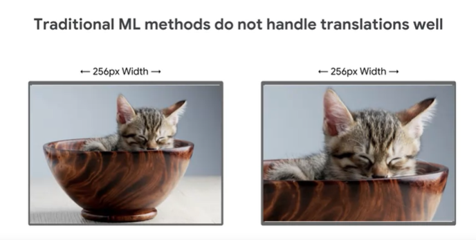
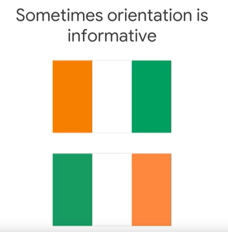
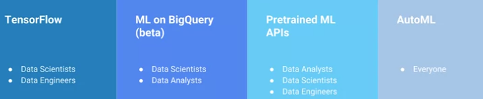
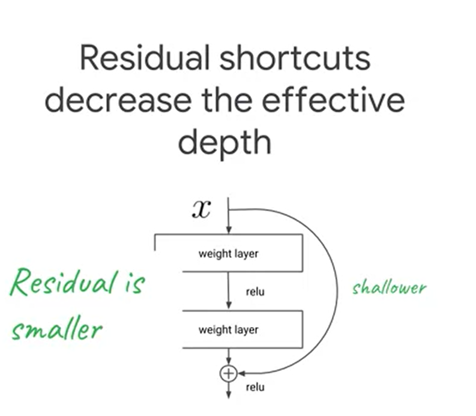
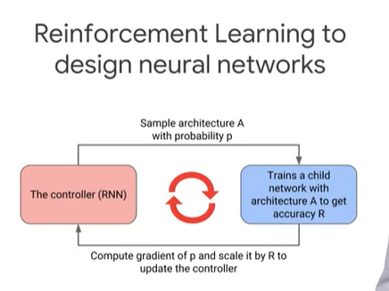

# use obsidian for reading it in a great pleasure

## Structured vs Unstrucuted Data
1. 8 MP camera dapat diartikan membuat **Sebuah gambar** dengan 8 **Million** Piksel , dan tentu hal ini dapat meningkantakna Input **Size*** Dari ML Modelnya sendiri which *Leads to* Inssufficient computing power dan juga **Long Training**
2. Take a look at this picture  Apabila melihat dari gambar, **Model Machine learning** Bakalan melakukan komparasi Piksel piksel, jadi **Kedua gambar tersebut berbeda**
3. Dalam Melakukan komparasi kesamaan antar kedua Vektor  **bisa bekerja lebih baik** pada **Structured data**. Namun, ketika dihadapkan dengan **Unstructured data** Become ga baik.  karena kita  **Membadingkan Piksel images**. Take Look Contoh gambar sebelumnya deh . Ketika kamu coba melakukan ZOOM in, maka nanti piksel nya berubah ya gak ? Nah ketika pikselnya berubah maka tidak bisa lagi tuh kamu melakukan yang namanya ***Euclidean distnace*** Hasilnya bakalan **Unreliable**.
4. ***Semakin Kecil Nilai Euclidean Distance*** Semakin **MIRIP**
5. VISI KOMPUTER Means --> **BAGAIMANA kita modelling Hubungan antara piksel ?**
## Images note
1. Pada saat melakukan **Trainig** pada image, adabaiknya kita memahami dahulu **Konteks permasalahannya**, 
	1. MultiClass --> **Kita prediksi satu hal dengan n Classes**
2. Apabila Modelnya **Unsure** yang berarti kurang paham atau kesulitan, **Silahkan Lihat confidence nya dan juga yang namanya Kemampuan manusia**
3. Softmax Function pada dasaranya adalah ***Mengubah nilai Floating values menjadi probabilities Ranging dari m - n*** Tapi ga merubah relative Ordernya ( Atau Urutan sebelumnya dengan cara melakukan **Ekponensiasi dan normalisasi pada inputnya**). Dimana eksponensiasi berarti **Memperbesar BOBOT dari floating point tersebut **
4. Loss Function --> Memberitahukan **Kualitas Dari Solusi/prediksi yang dilakukan oleh model** Semakin Kecil semakin baik
5. Dude ini Note penting, sebelum lu melakukan Komputasi **Mengenai Deep Neural net** Pastikan Simpler modelnya udah ga bisa dipake ya, **even sudah berusaha menggunakan feature engineering** Apalagi ketika datasetnya **Non Linear** 
6. So What is Dropout , intinya cuman **Mencegah Overfitting** hal ini dilakukan dikarenakan **Model deeplearning Tend to memorizing** dan **Dropout** adalah salah satu cara mencegah hal tersebut terjadi ya
7. Ketika mencoba membuat **Droput layer** antara layer **2** dengan layer **3**, somewhat **Layer 3** akan **Robust** terhadap suatu hal yang terjadi pada **Layer 2** 
8. Dropout **Limiting ability to learning**
### Convolution Neural Networks
Weheheh Aku lagi malas, jadi mau belajar **UX duls**

### Data Scarcity

Semakin besar **Kompleksitas Model** Semakin Banyak **Data** yang dibutuhkan 

Parameter sebuah Model, **Linear misalnya** Dalam masalah Citra dapat dihitung sebagai berikut
Height * Width * Weight+ bias

Kalau menghitung Parameter dari Conv2D cukup dengan
**Filters x  (Kernelsize x kernelsize x depth )+ bias x depth  **

Solusi dari Data Scarcity adalah
- Data Augmentasi
	Bisa melakukan beberapa hal sebagai berikut
	1. Blur
	2. Resize
	3. Crop
	4. Flip
	5. Hue
	6. Brightness

But pay attetion kepada **Augmentasi yang dilakukan**, bisa aja lu melakukan augmentasi, dan ternyata malah ngebuat **Model mislead** COntohnya sperti berikut

So apapun itu, selama kamu bekejra dengan augmentasi, pastikan hal hal yang hendak dilakukan **TELAH SESUAI** dan tidak menyebabkan **Misleading**. Btw kalau misalnya mau melakukan **Inference saat Decision Time** its not a good practice though, although **It's** good for **Boosting performance** But it's bad.

**Kalau mau lakuin Augmentasi, ada baiknya langsung dari input_fn ( Run time ) dari pada buatnya manual ( Stroge cost increase)**

pada dasarnya, Banyak tools yang tersedia untuk melakukan training di cloud.
Gunakan Kalau emang punya banyak resource aja ( Ga masalah sama duid )
- Cloud Vision --> Kalau task nya mudah kek klasifikasi hal hal umum( Dan lu ga punya dataset)
- Auto ML --> Kalau butuh custom label, yang memang lebih spesifik
- Buat model sendiri --> Pake tensorflow , cost low tapi time consuming ( Gw prefer ini sih )

### Transfer Learning

pada dasarnya melakukan transfer learning bukanlah hal yang tabu. Ya Gunakan kalau misalnya datanya sedikit. Pada transfer learning banyak hal yang bisa dilakukan, namun transfer learning dengan **Melakukan training** dari awal, Dan datasedikit akan membuat yang namanya**Overfitting** Solusi kepada hal ini adalah jangan **Melakukan training Apabila data sedikit **. Last Adalah Waktu komputasi yang lama ya :v

Model model tensorflow dapat dicari pada 
**Tensorflow Hub**
**Github Tensorflow/model**
Pada dasarnya itu aja sih, Untuk codenya udah ada ,tinggal go to code aja

###  BatchNormalization

Konsep yang bisa melakukan **Scaling** diantara layer. maksudnya adalah
Misal kita punya layer 3,4,5,6,7,8, dan 9 itu layer **Batch Normalization** maka ketika hendak **Passing weights** ke layer **10**, akan dilakukan semacam SCALING **Sehingga** seluruh neuron pada layer sebelum 9 nantinya dapat dijadikan input ke Layer 10 Dan **Layer 10** tetap memahami apa yang terjadi di layer sebelum sebelumnya. Hal yang terjadi adalah **Menkonversi setiap weights** di setiap layer menjadi **Z-Score** Mean 0, std =1. sehingga seleuruh **Bobot pada layer** memiliki **Same statistical nature** 
 1. Mempercepat training
2. Menghindari **Internal Covariate Shift** Model gabisa belajar lagi tapi bukan disebabkan **vanishing gradient** melainkan pembelajaran dilayer sebelumnya yang membuat bingung
3. Ketika Layer semakin **Deep** maka **weights** setiap neuron sulit untuk diatur, sehingga ketika Berada pada **Layer** paling dalam, maka akan terjadi banyak perubahan Nilai pada setiap neuronnya. **Semakin Deep Semakin Besar potensi dia malas belajar**. Think of it as **Step by step mengerjakan suatu tugas** kita lakuin satu satu, kita definisiin maksudnya apa. But pada satu sisi, ternyata kita udah gamau lagi ngerjain tugas tersebut, Kita gamau listen lagi inputan dari orang orang, thus no **IMProvement** Well itu lah kalau **Network** semakin deep.

### Residual Networks
Konsep resnet Ditujukan untuk mengatasi **Vanishing Gradient** maksudnya adalah untuk layer yang dekat dengan input say layer **2, 3 dan 4** dari 50 layer, memiliki Dampak **Gradient** yang kecil. Sehingga ya **Layer tersebut** learning nya ga banyak dan mungkin bisa saja ga di update. Resnet konsepnya **Beda**. Instead belajar mapping **input** ke **Output**, **Resnet mempelajari perbedaan antara output dengan original inputs**. 

Yep jadi pada akhirnya model yang belajar tadi akan lebih robust dan **Dapat meningkatkan learning** lebih baik lagi even ketika dibuat **Deep layer** karena pada dasarnya, **Resnet mempelajari perbedaan antara output dengan original inputs** bukan mapping **Dari inputs ke output**

### Neural Archicture Search
Konsep untuk **Automasi pembuatan  network model**
**Reinforcment learning digunakan untuk desain  neural networks**

intinya adalah **Controller** Probability training arhcitecture A akan lebih besar jika **Arsitektur** tersebut memberikan **Output** yang baik

